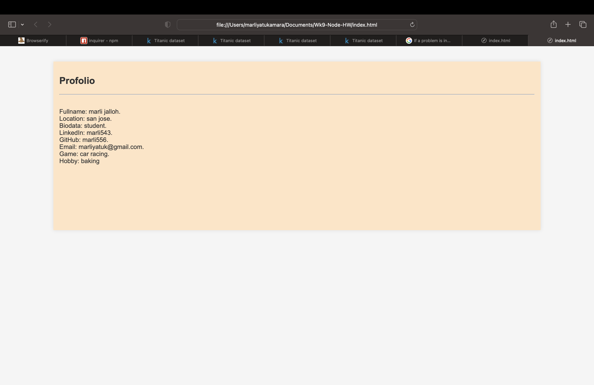
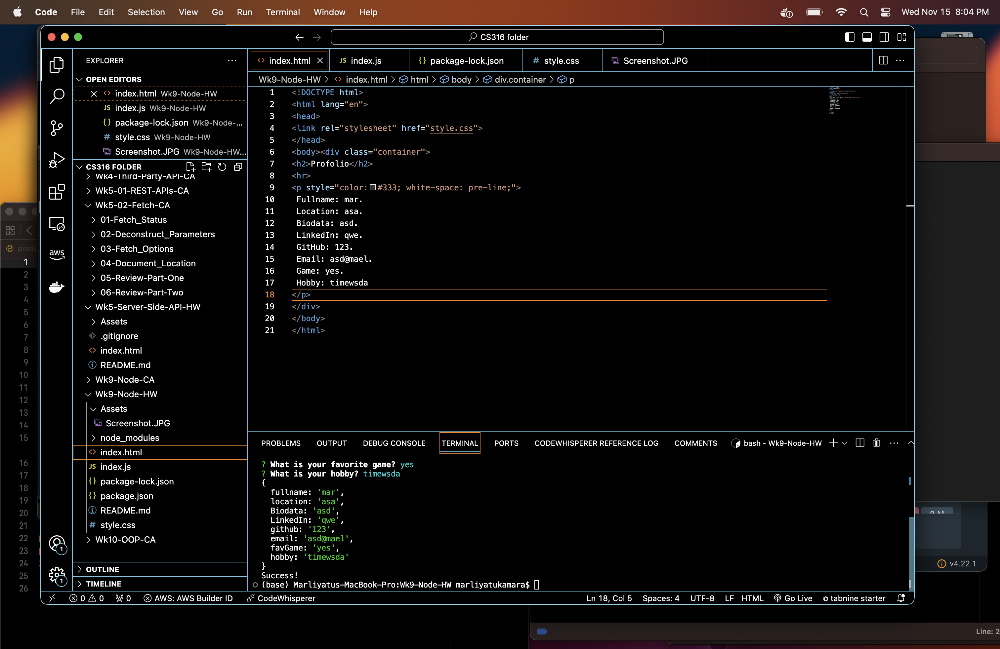

# repositories_app
web development

**repositories_app**
This game is an interactive game that allow user to play it by tasting their knowledge on computer science questions and add all the score and display at the end of the game.

##repository Contents 
- [Userguide](#userguide)
- [How to start](#how-to-start)
- [Built With](#built-with)
- [About](#about)

## Userguide
 This is a prompt questions application that allows user to answer question about themselve using npm and they  it can 
 in the browser by running the index.html file

## How to start
- first, right click the **index.js** and open it on the integrated terminal.
- next, open the file by ** node index.js**.
- Answer every queation one at a time.
- check to see if your anwser matches the printed anwsers.
-  finally, you can open the html file on the browser to see how it will print.

## Built With
- HTML
- CSS
- JavaScript/NPM

## About
This is a prompt questions application that  allows user to answer question about them using npm and can 
them in the browser by running the index.html file

## what are learned from this project
This project allow me to understand the basics of npm usages and how powerful it can be in web development.furthermore, 
i plan to dive deeper to better understand it.

## link_to the video and screenshoots

### Screenshots

### Video

